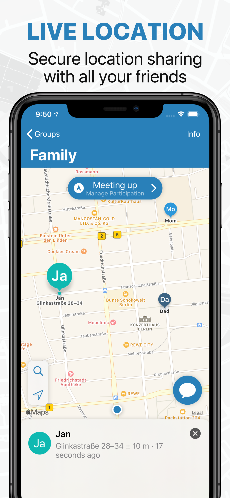
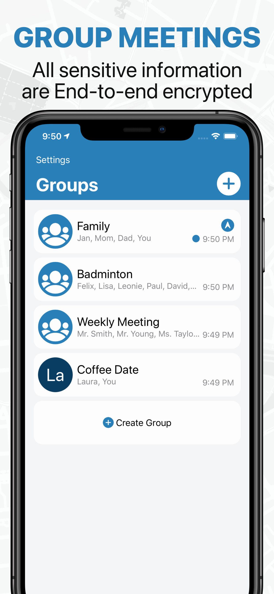
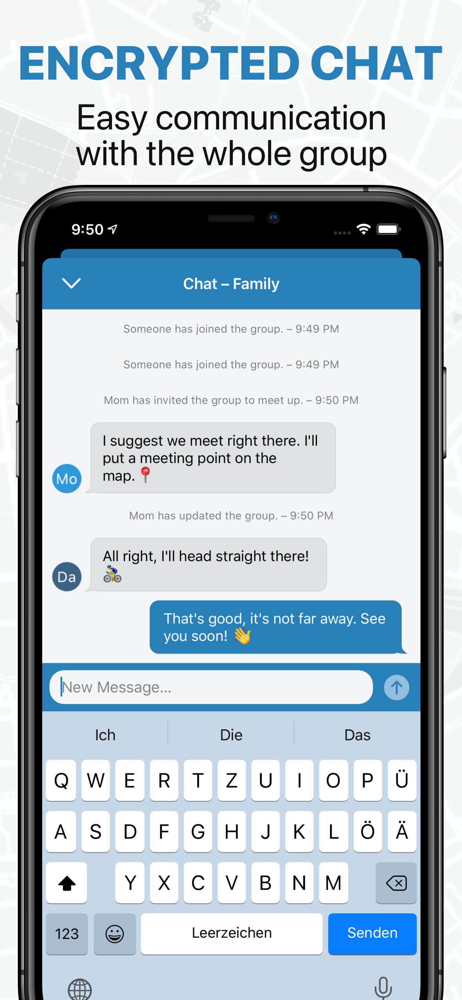
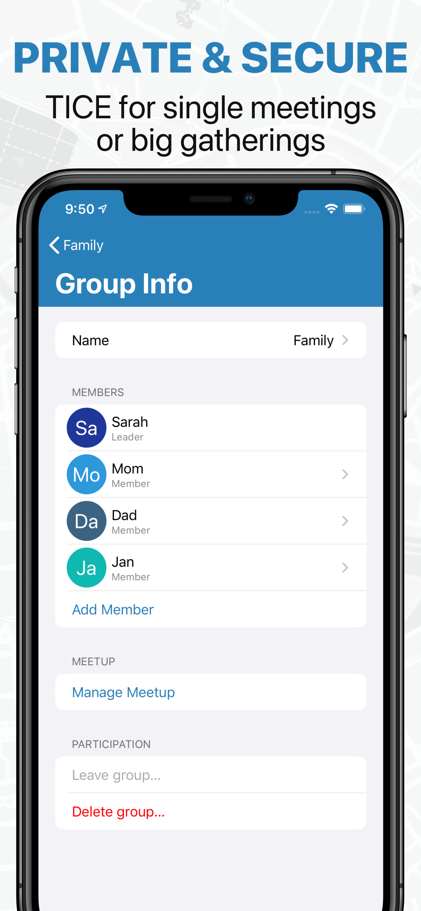

# TICE – Locate Friends & Meet Up
 

The secure app for meeting up, sharing locations and locating friends and family in real-time. TICE allows live location sharing on iOS, Android and the Web. Privacy by Design and modern end-to-end-encryption protect the sensitive location data from others.

## Screenshots

 |  |  | 
:-:|:-:|:-:|:-:

## Download

[](https://apps.apple.com/us/app/tice-secure-location-sharing/id1494324936)

# Open Source Development Goals

TICE is a simple but powerful tool to share you location in real time with friends, family and others. Knowing the location of others can be an efficient way for meeting up, it can help find each other and provides a safe way to know, a close friend or family reaches their destination safely.

## 1. Security and transparency

As location information tells a lot about the person, access to it needs to be safeguarded. TICE therefor tries to find a good balance between a practical tool and a safe place for its users location, messaging and meta data. TICE follows the privacy by design path. This means, that we collect only the minimal amount of information needed, encrypting sensitive data in a way that we don't have access to it and be transparent by disclosing the source code behind TICE.

## 2. Grow further

We put a lot of effort into TICE. By open sourcing it, we want it to grow even further – instead of getting stuck. As the company behind TICE, we will focus on other projects in the future. That is why TICE needs you and your contribution.

## 3. Feature rich & living

TICE should be a living project and improve over time. The distributed apps over the app stores should always be up to date and accompany the operating system development. There are a lot of features missing from TICE and we want to build those together with the open source community.

# Contribute to TICE

This section explains, where and how you can contribute to TICE.

## Build instructions

TICE iOS has several dependencies. It is using brew, ruby gems and swift package manager for the dependency management.

### Install all dependencies
```bash
$ make all
```

The submodules `Server` and `CnC` are not needed to build, run and unit test the application.

### Open the TICE project in Xcode
```bash
$ xed .
```

### Run the (unit) tests from the command line
```bash
$ make unit_tests
```

### Run TICE on your device
In order to run TICE on your device you need to change the bundle id and create provisioning profiles for that bundle id and your devices (e.g. via Xcode). 
*Note: All push related features will not work on your device or in the simulator.*

## Architecture

TICE iOS represents the iOS app for TICE. It interacts with the TICE server (backend) by using a JSON REST API.

TICE uses dependency injection via initializers and specifies protocols (`SomeManagerType`) for classes to allow passing mocked objects for easier testing.

The UI code of TICE uses different design architecutes. For complex views and for better testability, it follows a [Model-View-ViewModel](https://en.wikipedia.org/wiki/Model–view–viewmodel) (MVVM) style, for others it follows the default [Model-View-Controller](https://en.wikipedia.org/wiki/Model–view–controller) (MVC) style.

### Requirements

- Xcode 12+
- iOS 13+

## Beta testing

To help with testing new app updates, TICE on iOS has multiple pre-release versions:

- TICE Preview via TestFlight
  - Beta builds that needs excessive testing. Testing TICE Preview could render user data as unusable, so prepare to re-install when necessary.
  - This app is isolated from the normal TICE app and its environment, so groups and users created only exist in the corresponding app.
  - [Join TICE Preview via TestFlight](https://testflight.apple.com/join/X2INi0ZY)
- TICE via TestFlight
  - Release candidates for TICE. Last step before release, likely to be stable.
  - Uses the same environment as the App Store version
  - [Join TICE via TestFlight]()

To help with testing app updates before they're released, you can install and test the TICE Preview by [signing up via TestFlight](https://testflight.apple.com/join/X2INi0ZY) or you can install and test the more stable TICE TestFlight version 

### Install the TICE Preview app

You will receive a notification via TestFlight when new updates are available. 

### Bugs

File any bugs you find by filing a GitHub issue with:
- Device information
- Repro steps
- Observed behavior (including screenshot / video when possible)
- Timestamp and email address used to send the logs (see below)
- Expected behavior

and **send the logs** in the app via `Settings -> Give Feedback` per mail.

# License

## Core Collaborators

- [Andreas Ganske](https://github.com/ChaosCoder)
- [Fabio Tacke](https://github.com/FabioTacke)
- [Simon Kempendorf](https://github.com/code28)

## Copyright

Copyright © 2019 [TICE Software UG (haftungsbeschränkt)](https://tice.software). All rights reserved.

The source code is licensed under [GNU General Public License v3.0](LICENSE). TICE is a [registered trademark](https://euipo.europa.eu/eSearch/#details/trademarks/018132140) of the TICE Software UG (haftungsbeschränkt).